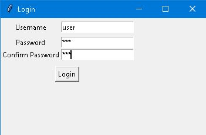
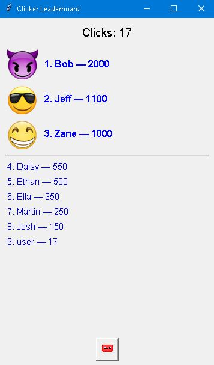
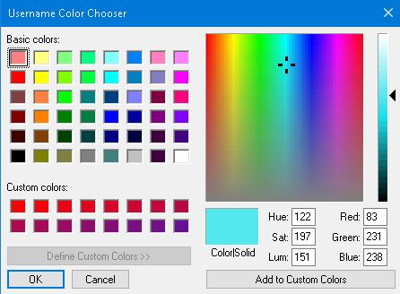
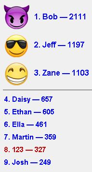
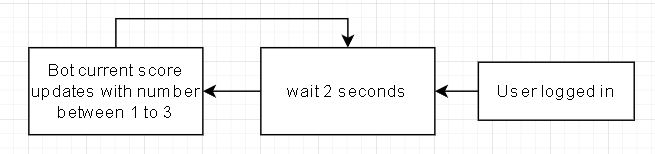
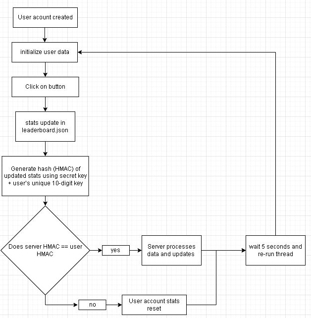

# Game Screenshots & Diagrams
## Login Page
This game allows users to create an account with a username and password, and saves their score to a hashed file(hashing functions in progress). When the user logs in again, their data (username, password, score) is loaded from the file so they can continue where they left off. If the account doesn’t exist, a new one is created.

  

## Game Play
This is what the Cookie Clicker game looks like. The button has animations for looks, and the leaderboard updates based on the player's score.

  

## Leaderboard update

  

## NEW added username customisation
Users can now select a custom color for their username. This preference is saved and automatically applied each time the account is accessed, enhancing personalization. Below is the color selection.
The leaderboard displays their usernames with the selected colors, creating a more personalised experience.

 
  
  

# Flowchart Depictions
This section contains flowcharts that explain how the game functions

## Leaderboard updating for added competitiveness
To increase competitiveness, bots have their scores updated by 1–3 clicks every 2 seconds.

  

## In Progress: Verification to Prevent Data Modification concept (user side hash verification has been added)
To prevent cheating or file tampering, this game uses HMAC (Hash-based Message Authentication Code) to verify updated leaderboard data.

  

