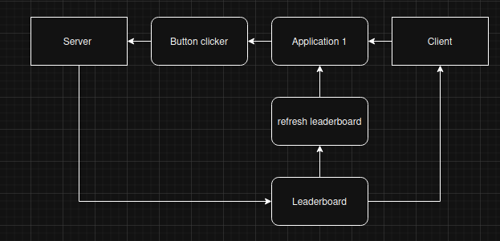
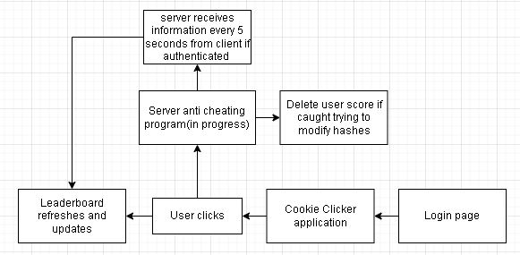

# Overview
This is a Python Cookie Clicker game featuring secure client-server communication using native Python networking libraries and Base64 message encoding communicating through TCP. That saves player progress and acount information e.g. username and password allowing users to not have to sign in again.

  

## Key Features

- **TCP Socket Communication**: Persistent connections between client and server

- **Base64 Message Encoding**: Simple data encoding

- **Login system**: Allowing different usernames

- **Leaderboard updating**: Leaderboard updates and saves user progress 

- **Improved UI**: top 3 players in the leaderboard have different emojis

- **Simulated bots** randomly update their scores to create a competitive leaderboard

- **Hash based security** prevents users from modifying the leaderbaord data by verfiying with a hash file.  
## In progress

- **Improved account security and activity logging with customizable usernames**

## Original game concept

  

## Updated game Prototype

  

## More Documentation (Game Screenshots & Features)

### [Additional Information](AdditionalInfo.md)
 

## Acknowledgments

Thanks to **Archangel Lusiama** ([@hinology18](https://github.com/hinology18)) for collaborating on the development during the project.

