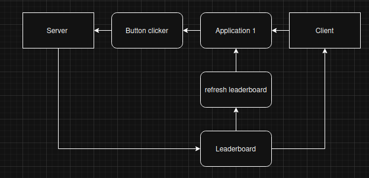

# Overview
This is a Python Cookie Clicker game featuring secure client-server communication using native Python networking libraries and Base64 message encoding communicating through TCP. That saves player progress and acount information e.g. username and password allowing users to not have to sign in again.

  

## Key Features

- **TCP Socket Communication**: Persistent connections between client and server

- **Base64 Message Encoding**: Simple data encoding

- **Login system**: Allowing different usernames

- **Leaderboard updating**: Leaderboard updates and saves user progress 

- **improved UI**: top 3 players in the leaderboard have different emojis

## In progress

- **improved data security e.g. hashing and server logging**

## Original game concept

  

# The Leaderboard emojis

## First in the poduim 

  

## Second in the poduim 

  

## Third in the poduim 

  

